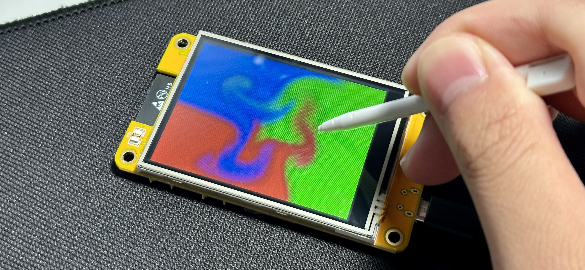

# ESP32-fluid-simulation



This is a fluid simulation running on an ESP32, namely the one embedded into a development board that has been dubbed the "Cheap Yellow Display" (CYD) on Brian Lough's Discord channel (monorepo [here](https://github.com/witnessmenow/ESP32-Cheap-Yellow-Display)). In a few words, it squeezes out enough contiguous ranges of memory from the ESP32 then applies Jos Stam's famous technique on a *very* small domain of 80x60. In more words:

1. It strategically uses `volatile` and `reinterpret_cast` to force floats to be represented as integers to the ESP32, thus allowing floats to be stored in the ESP32's IRAM. (see `iram_float.h` and https://github.com/espressif/esp-idf/issues/3036)
2. It contains a portable and simple (though not state-of-the-art) C++ implementation of Jos Stam's fluid simulation method, running on a PC down to even an ESP32.

That said, it only runs at 12fps, and it isn't what I originally wanted to make: free-surface simulation under gravity. For that, see the project [pi-sph-fluid](https://github.com/colonelwatch/pi-sph-fluid) that I completed much later.

## Running

⚠️ **Disclaimer!** ⚠️ This project crashes when compiled with older versions of the ESP32 Arduino core (for example v2.0.11, see issue #1) and fails to compile with versions v3.0.0 and newer. Update to v2.0.17 in the Arduino library boards manager before compiling.

This project is built in Arduino, and the only dependencies are [TFT_eSPI](https://github.com/Bodmer/TFT_eSPI) (this requires a custom `User_Setup.h` first, see the monorepo for one working example) and [XPT2046_Touchscreen](https://github.com/PaulStoffregen/XPT2046_Touchscreen). Vendors for the CYD can be found through the monorepo. There is also code that will run the same fluid simulation on a PC. Navigate to the repo directory then call:

```
g++ test/fluid_simulation.cpp -O3 -Wall
./a
python3 test/animate.py
```

## Really helpful sources

If you're interested in the CYD, the monorepo was critical for me to get started with it.

If you're interested in this specific kind of fluid simulation and you have an understanding of multi-variable calculus, here are some sources I would recommend:

* A beginner-friendly intro: http://jamie-wong.com/2016/08/05/webgl-fluid-simulation/
* An older, more comprehensive guide: https://developer.nvidia.com/gpugems/gpugems/part-vi-beyond-triangles/chapter-38-fast-fluid-dynamics-simulation-gpu
* A helpful guide written by Jos Stam (just Google this): Stam, Jos 2003 *Real-Time Fluid Dynamics for Games*