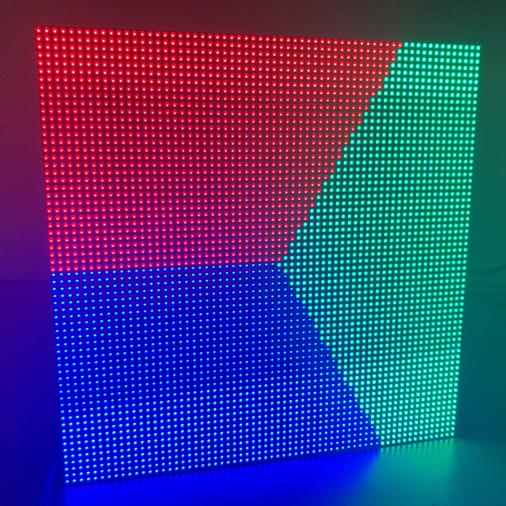

# ESP32-fluid-simulation

<a href="https://youtube.com/watch?v=irnR6CXNcMc"></a> <a href="https://youtube.com/watch?v=irnR6CXNcMc"></a>

*Click through either image to view demonstration on Youtube*

This is a fluid simulation running on an ESP32, where pressing the BOOT button stirs up the display a little. In a few words, it squeezes out enough memory from the ESP32 in order to apply applies Jos Stam's famous technique on a *very* small domain (a 64x64 RGB display). In more words:

1) It strategically uses `volatile` and `reinterpret_cast` to force floats to be represented as integers to the ESP32, thus allowing floats to be stored in the ESP32's IRAM. (see `iram_float.h` and https://github.com/espressif/esp-idf/issues/3036)
2) It contains a portable and simple (though not state-of-the-art) C++ implementation of Jos Stam's fluid simulation method, running on a PC down to even an ESP32.

That said, it only runs at 18fps (memory bound, accessing IRAM required extra instructions), and it isn't exactly what I wanted to make this summer either (free-surface fluid simulation with gravity, that turned out to be way more complicated than I thought), so I'll be moving on from this project to a necessarily more powerful Teensy 4.0 (or PC-powered) version later. If I make any updates to the core code then, I'll probably back-port it to this repo.

## Running
This project is built in Arduino, but please read the header comment of `ESP32-fluid-simulation.ino`. It contains instructions for raising the optimization level from `Os` to `O2`, and that's necessary for the speed I recorded. Though this project uses Adafruit's Protomatter library, I ran this on a board for the library [ESP32-HUB75-MatrixPanel-I2S-DMA](https://github.com/mrfaptastic/ESP32-HUB75-MatrixPanel-I2S-DMA) (just take the pinout in that repo).

There is also code that will run the same fluid simulation on a PC. Navigate to the repo directory then call:

```
g++ test/fluid_simulation.cpp -O3 -Wall
./a
python3 test/animate.py
```

## Really helpful sources
If you're going to dive into this, here are some sources I would recommend:
* A beginner-friendly intro: http://jamie-wong.com/2016/08/05/webgl-fluid-simulation/
* An older, more comprehensive guide: http://developer.download.nvidia.com/books/HTML/gpugems/gpugems_ch38.html
* A helpful guide written by Jos Stam (just Google this): Stam, Jos 2003 *Real-Time Fluid Dynamics for Games*
Though I'd highly recommend an understanding of multi-variable calculus first.